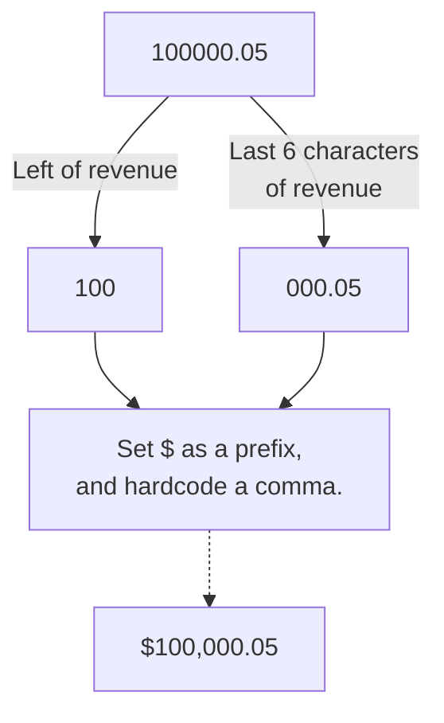
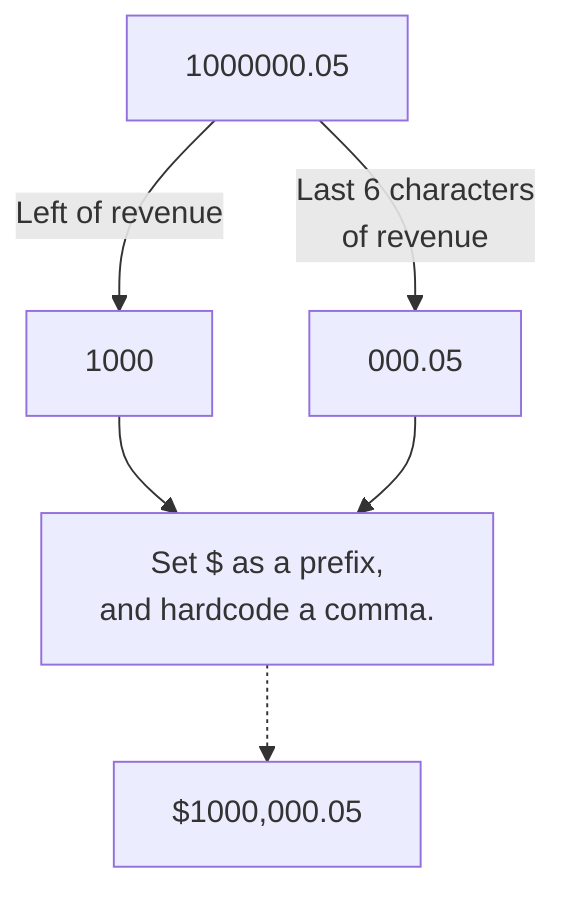

# toStringCharacterFormatting

## Problem Statement

To print numeric data types into:

- Currency
- Percentage

## Key String Formatting Parameters

- `#,##0.00`
- `#,##0`
- `$#,##0.00`
- `$#,##0`
- `0%`

---

## Business Use Case

If there is a need to convert a numeric data type from a JSON object retrieved from an API response within a Deluge script, we can use `toString()`.

Though, there are quick hacks that gets you to the same end result, such as printing a revenue of `100000.05` into `$100,000.05`.

```jsx
revenue = 100000.50;
leftRevenue = left(revenue,len(revenue)-6); //gets the left characters, ignoring the last 6 characters: 100
rightRevenue = right(revenue,6); //gets the last 6 characters: 000.05
info "$"+ leftRevenue + "," + rightRevenue; //returns $100,000.05
```

This achieves the outcome of printing `$100,000.05` by stitching the left and right sections of a number, being converted into a string, and prefixing the dollar sign to the string.



However, this does not handle anything that goes beyond hundreds of thousands. For example, if we were to parse a revenue data of 1000000.05 (That’s *one million* and *five cents*)..

```jsx
revenue = 1000000.05;
leftRevenue = left(revenue,len(revenue)-6); //gets the left characters, ignoring the last 6 characters: 1000
rightRevenue = right(revenue,6); //gets the last 6 characters: 000.05
info "$"+ leftRevenue + "," + rightRevenue; //returns $1000,000.05
```



This will print out `$1000,000.05`, which is missing of a comma to separate the million and hundred thousand.

There are other creative ways to run this through a loop and get to the expected outcome, but let’s leverage the `toString()` function and talk about the..

---

## Solution

### Currencies

`toString()`, according to the [Zoho Documentation](https://www.zoho.com/deluge/help/functions/common/tostring.html), allows us to change date and date time data type and format it into something meaningful to read for the end users.

It appears that `toString()` allows more than just printing date time. As mentioned in the Key String Formatting Parameters earlier on in this document, the string formatting to use will be `#,##0` to help understand the results.

If we used the same revenue of *one million and five cents* and would like to print it out as a currency:

```jsx
revenue = 1000000.05;
revenue = revenue.toString("#,##0");
info revenue; // Returns 1,000,000
```

We’re 5 cents short.

~~🤯 If we invested this 5 cents into an optimistic financial instrument market, 5 cents can be a lot of money today!~~

It is good to know that data can be truncated when we do not specify decimal places. This might be an issue on handling business facing reporting requirements, so let’s have a look how we include including decimal places.

```jsx
revenue = 1000000.05;
revenue = revenue.toString("#,##0.0");
info revenue; // Returns 1,000,000.0

revenue = 1000000.05;
revenue = revenue.toString("#,##0.00");
info revenue; // Returns 1,000,000.05
```

At this point, it’s good to note the data is truncated, and does not round up, or round down. So selecting the amount of decimal places can be important.

ℹ️ If you add more 0’s, like `#,##0.00000`, this would return 5 decimal places.

Now that we know how to add decimal places, let’s look at how do we add the dollar sign by converting the numeric data type into a currency text string.

```jsx
revenue = 1000000.05;
revenue = revenue.toString("$#,##0.00");
info revenue; // Returns $1,000,000.05
```

The only difference between the code above, against the other codes, is to add whatever currencies you’d like as a text. Generally, these text manipulation functions would pick up key patterns to transform the data type into something you need it to be. If it does not recognise the patterns that is parsed into the function, then it prints out the text as a whole.

ℹ️ If you replace `$` with a random blob of words, it will print the random blob of words out.

Meaning, if you wanted to print the Pound Sterling sign as part of the currency..

```jsx
revenue = 1000000.05;
revenue = revenue.toString("£#,##0.00");
info revenue; // Returns £1,000,000.05
```

This is a better way to handle larger numbers, like billions, or trillions, and maybe more decimal points, `toString()` handles this well.

### Percentages

Percentages are pretty straightforward, and it appears it does not handle decimal places, so it might be better off with concatenating a percentage symbol (%) with a number to print out the decimal places.

However, if we’d like to leverage `toString()` to handle this, then here is an example of converting `20` into `20%`.

```jsx
percentage = 20;
percentage = percentage / 100; // Stored at 0.2
info percentage.toString("0%"); // Returns 20%
```

For *line 2* in the solution above, you will need to imagine 100% is supposed to be expressed as 1 in a number. So any number stored as an absolute number will need to be divided by 100 if `toString()` is to be used.

ℹ️ Yes, it is very similar to Google Sheets, and Microsoft Excel.
